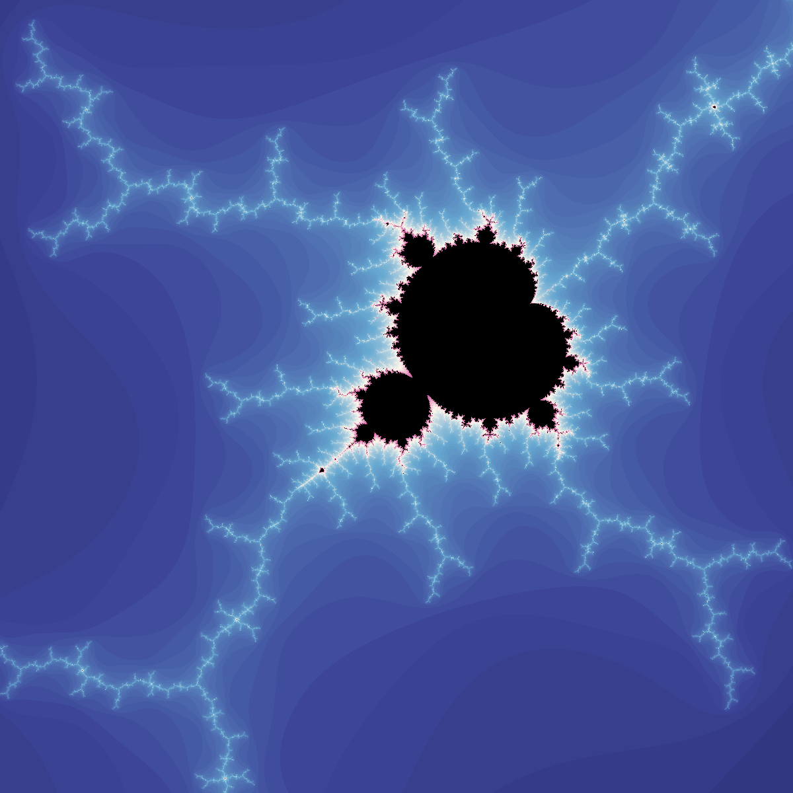
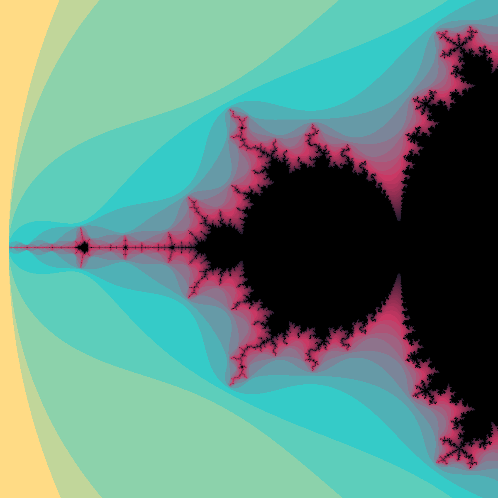
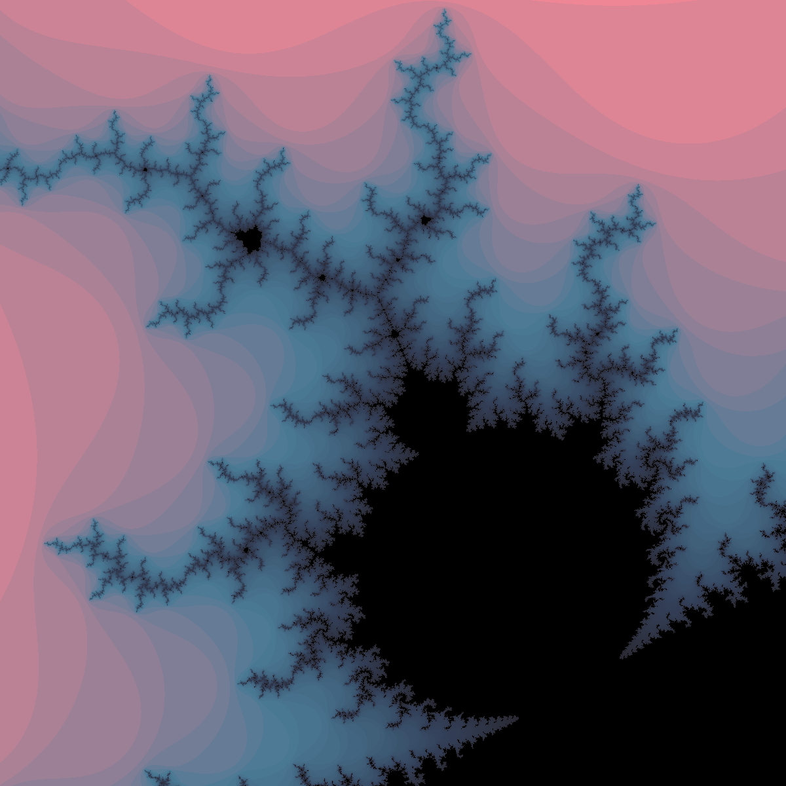

# Mandelbrot/Julia Fractal Shader (Godot 4)

<table>
    <tr>
      <td></td>
      <td></td>
      <td></td>
      <td></td>
    </tr>
    <tr>
      <td></td>
      <td></td>
      <td></td>
      <td></td>
    </tr>
  
</table>

[](demo_files%2FJulia%20Set%20Scroll.mp4)


## Description

A shader toy program for exploring the [Mandelbrot and associated Julia sets](https://en.wikipedia.org/wiki/Mandelbrot_set)
* zoom and left-click drag with mouse to change the view
* right-click or right-click drag to update the coordinate input for the Julia set
* screenshot your favorite views
* select from a number of handpicked palettes or add your own


### Shader snippet 
 Shown below is the key math bit for generating all this complexity. Rather simple!
 ```
    // perform at most iterations number of steps
	for(int loops = 0; loops < iterations; loops++) {

		// z' = z^2 + c
		zp = cx_mul(z, z) + c;
		z = zp;

		// f(z, c) has escaped if | z_n | > 2.0
		if(length(zp) >= 2.0){

			// save how many steps it took to escape
			esc = loops;
			break;
		}
	}
```

### Custom Palettes

1. Download [Godot 4](https://godotengine.org/download/windows/), open and run the project. (Lmk if there are any issues!)
2. Find a palette you like (or make your own!). [Lospec](https://lospec.com/palette-list) has a good variety of fun palettes, with new ones being added regularly.
   - _1 px tall, number of colors wide_
   -  _4 to 10 colors work best_
   - _Experiment with color arrangements!_
3. Add the palette texture(s) to `palette/textures`
4. Run the 'palette/palette_loader.gd' editor script. (Select `Run` from script dropdown or `Ctr + Shift + X` when in the script editor)
5. The palette resources should now be regenerated using your new palette(s)!

### Executables

Program is available for Windows, and Web ([on itch](https://nebularinkstain.itch.io/mandelbrot-fractal))


## Further Reading Material :)
* [Introduction to Mandelbrot and Julia Sets by Ruben van Nieuwpoort](https://paulbourke.net/fractals/mandelbrot/Ruben_van_Nieuwpoort.html)
* [A variety of blog articles about fractal phenomena](https://paulbourke.net/fractals/)

## License

This project is licensed under the [MIT License](https://opensource.org/license/mit) - see the LICENSE.md file for details


